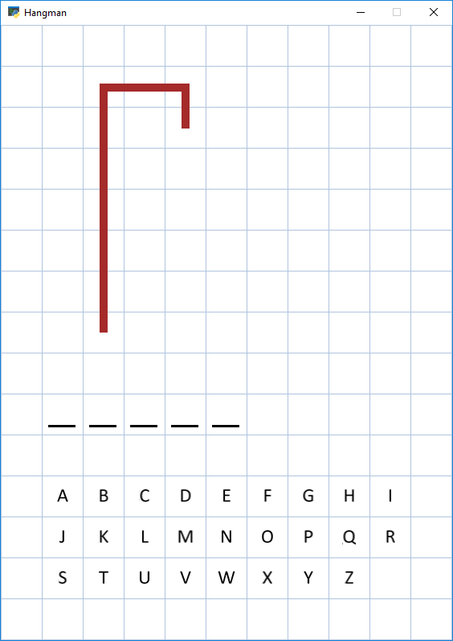
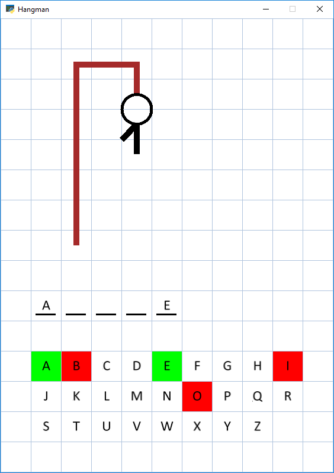
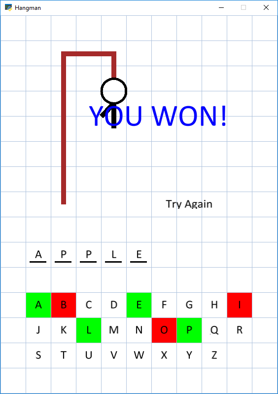

# Hangman Game 
Simple hangman game implementation using Arcade.

### Prerequisites

Written in Python (Version 3.7.4).

Packages required:  
-> numpy  
-> arcade

### Run

To run the game, execute main file.  

## Customization

User can add words to the dictionary file. For now, words longer than 10 will not work properly with the game. To fix that, it is required to increment the 'COLUMN_COUNT' constant at the beginning of the file. Multiple words guesses are not allowed yet.

## Example

1. Game randomly selects a word from the provided dictionary.  
2. User chooses guesses by pressing on the grids with the given letter.  
3. After game finishes by either guessing correctly or missing on a letter 6 times, appropriate message is displayed. Pressing 'Try Again' restarts the game (with a new word).
  

## Summary

Game was an one-day project and thus have some limitations regarding the dictionary. In the future I may extend the functionality to make it possible to add longer words without modifications to the code and do mupltiple-word guesses.
